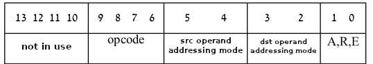
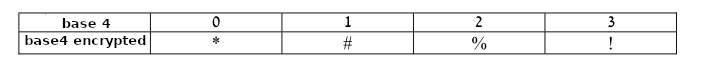

# Two-pass Assembler


## Описание

Программа представляет собой двух-проходной ассемблер с препроцессором, написанный на языке C / ANSI, для перевода ассемблерного кода в фактический машинный код в соответствии со спецификациями тех. задания.

## Принцип работы программы
Входные данные:

• Программа принимает в качестве аргументов имена одного или нескольких файлов с расширением .as содержащих assembly код. Имена вводятся без указания расширения .as.

### Пре-процессор:

• Принимает на вход файлы с ассемблерным кодом (.as).
• Проверяет длину строки и удаляет комментарии и лишние пробелы.
• Разворачивает макросы обозначенные ключевыми словами mcr и endmcr.
• Создаёт промежуточный .am файл

### Первый проход:

• Принимает на вход файл .am созданный препроцессором.
• Проверяет код на наличие синтаксических ошибок.
• Обрабатывает директивы .data, .string, .extern, .entry для определения переменных, строк, внешних и внутренних меток.
• Создает таблицу символов.

### Второй проход:

• Обрабатывает инструкции, проверяет логические ошибки.
• Генерирует машинный код на основе таблицы символов и инструкций.
• Создаёт образ памяти хранящий последовательность машинных инструкций, где Каждая инструкция кодируется в несколько последовательных слов памяти, начиная от одного и заканчивая максимум пятью словами, в зависимости от используемых методов адресации. В целях безопасности, данные и инструкции разделены (адрессация блока данных начинается после последней инсткурции).

## Параметры системы
    • CPU с 8 регистрами по 14 бит (r0 - r7) .
    • 4096 адресов памяти.
    • Регистр состояния программы (PSW).
• Первое слово каждой инструкции имеет вид:




## Содержание файлов полученных в результате работы программы

Файл .ent (Entry)

• Содержит список внутренних символов с их адресами в машинном коде.

Файл .ext (External)

• Содержит список внешних символов и ссылки на них в машинном коде.

Файл .ob (Object)

• Содержит фактический машинный код в зашифрованном и его адресацию.

## Обработка ошибок

   • Программа осуществляет проверку синтаксиса и семантики ассемблерного кода.
  
   • Обнаруженные ошибки выводятся с указанием строки и характера ошибки.

   • Программа прерывает работу при обнаружении критических ошибок, обеспечивая корректное функционирование.

## Дополнительные особенности
Конечный результат представлен в зашифрованном виде:




## Установка
### Требования системы
```
! GCC compiler
! Linux/Ubuntu system
```

Программа компилируется с помощью MakeFile.

В терминале ввести `make` для запуска MakeFile  и компиляции программы.

## Использование
Запустите скомпилированную программу с помощью следующей команды:

`./assembler имя_файла_1 имя_файла_2... имя_файла_N`

### Клонирование репозитория

```bash
git clone https://github.com/vvsxx/assembler.git
cd assembler
```
